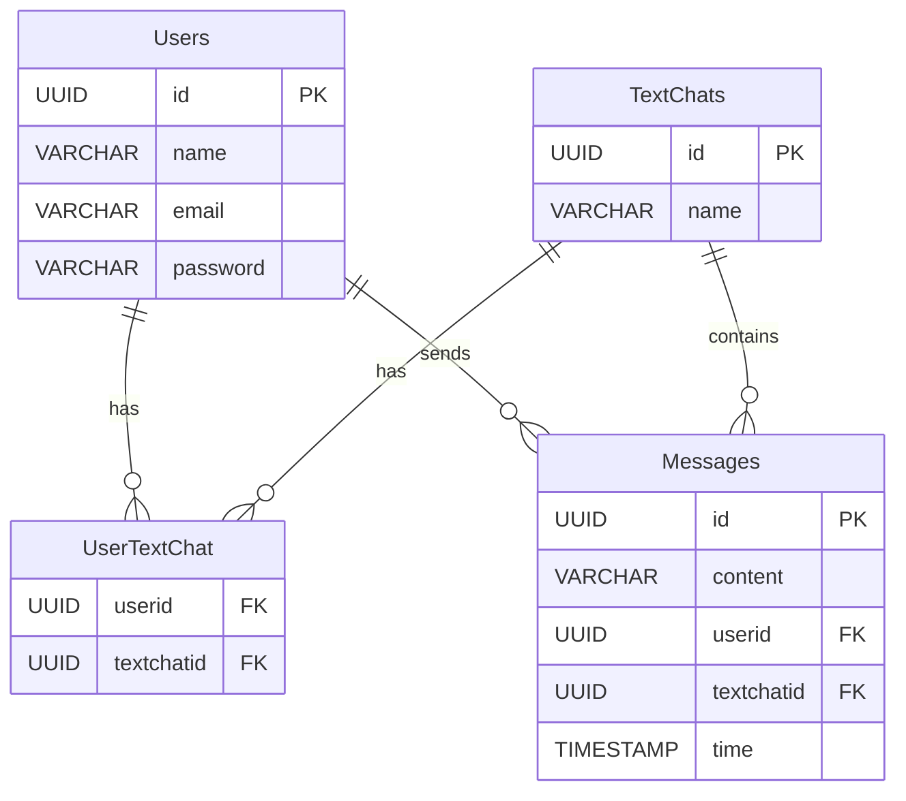

# Drocsid

### Project Structure

The project is divided into two main parts:

1. **Frontend**: Developed by Kajmaks
2. **Backend**: Developed by Bejmach

### Technologies Used

#### Frontend
- **React**: A JavaScript library for building user interfaces.
- **TypeScript**: A superset of JavaScript that adds static types.
- **Vite**: A build tool that provides a fast development environment.
- **Material UI**: A popular React UI framework for building responsive and accessible web applications.
- **Axios**: A promise-based HTTP client for making requests to the backend.

#### Backend
- **Node.js**: A JavaScript runtime built on Chrome's V8 JavaScript engine.
- **Express**: A web application framework for Node.js, designed for building APIs.
- **MySQL**: A relational database management system for storing user and chat data.
- **WebSocket**: A protocol for full-duplex communication channels over a single TCP connection, used for real-time voice chat.

## Features

### User Authentication
- Users can register and log in to the application.
- Passwords are securely hashed before being stored in the database.

### Chat Functionality
- Users can create and join chat rooms.
- Direct messaging (DM) functionality allows users to communicate privately.
- Real-time message updates using WebSocket for voice chat.

### Voice Chat
- Users can initiate voice conversations with other users in real-time.
- Audio data is processed and transmitted using WebSocket.

### User Interface
- A responsive design that adapts to both desktop and mobile devices.
- User-friendly interface with intuitive navigation between chat rooms and friends list.

## Installation

### Frontend Setup

1. **Clone the repository**:
   ```bash
   git clone <repository-url>
   cd client
   ```
2. **Install dependencies**:
   ```bash
   npm install
   ```
3. **Start the development server**:
   ```bash
   npm run dev
   ```

### Backend Setup

1. **Clone the repository**:
   ```bash
   git clone <repository-url>
   cd server
   ```
2. **Install dependencies**:
   ```bash
   npm install
   ```
3. **Create .env file** in ./server/config folder:
   - Database
     - DB_HOST - database host like "localhost"
     - DB_USER - database user like "root"
     - DB_PASSWORD - password for user
     - DB_DATABASE - name of the database, preferably "drocsid"
   - Encryption
     - SALT - char(16) used for salt enctyption for sha512

    **example .env file**

   ```plaintext
    DB_HOST=localhost
    DB_USER=root
    DB_PASSWORD=root
    DB_DATABASE=Drocsid
    SALT=7f9G2bK4pQ1xY6rT
   ```
4. **Start the server**:
   ```bash
   node app.js
   ```

## Database structure


## API Endpoints

### User Routes
- **GET /api/users/all**: Retrieve all users.
- **GET /api/users/register/:name/:email/:password**: Register a new user.
- **GET /api/users/login/:name/:password**: Log in a user.
- **GET /api/users/chat/:chatid**: Get users from a specific chat.

### Message Routes
- **GET /api/messages/get/after/:chatid/:messageid**: Get messages after a specific message ID.
- **GET /api/messages/get/:chatid/:limit/:offset**: Get messages from a specific chat with pagination.
- **GET /api/messages/send/:chatid/:userid/:content**: Send a message to a chat.
- **GET /api/messages/all**: Get all messages.

### Text Chat Routes
- **GET /api/textchat/create/:name**: Create a new chat.
- **GET /api/textchat/all**: Get all text chats.
- **GET /api/textchat/chats/:userid**: Get all chats for a specific user.
- **GET /api/textchat/dm/:userid**: Get all direct messages for a specific user.

### User Text Chat Routes
- **GET /api/usertextchat/join/:chatid/:userid**: Join a user to a chat.
- **GET /api/usertextchat/all**: Get all user text chats.
