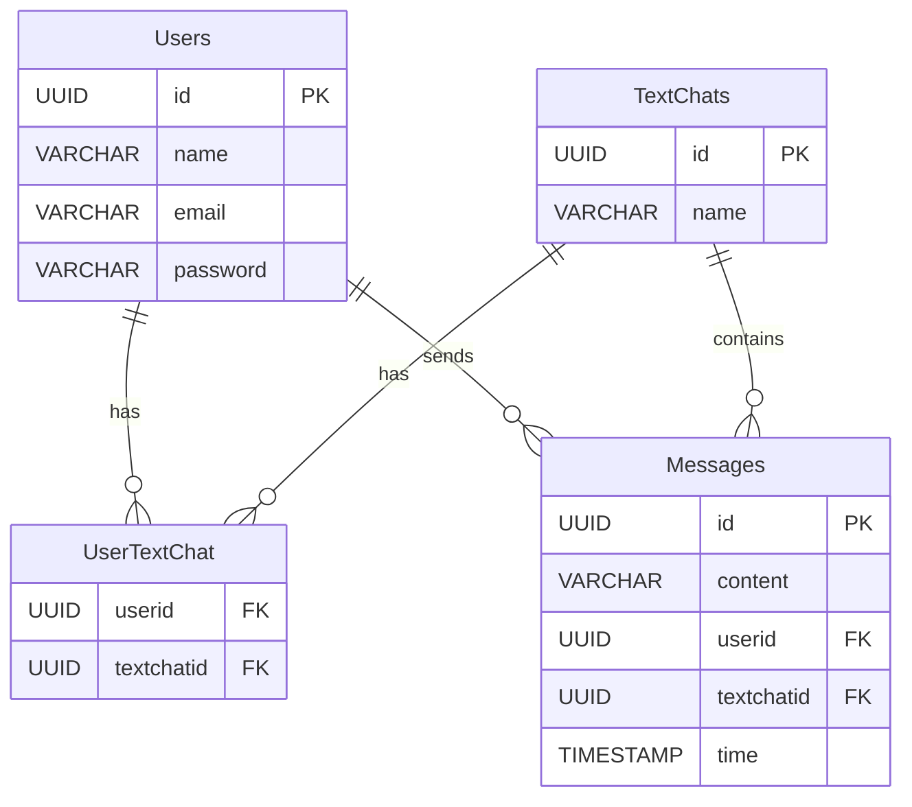

# DROCSID

## Client

### Preparation
```bash
$ npm install
$ npm run dev
```

### Page
[drocsid](https://localhost:5173)

## Server

### Preparation

```bash
$ node main.js
```

#### also create .env file in ./server/config path with values
- Database
  - DB_HOST - database host like "localhost"
  - DB_USER - database user like "root"
  - DB_PASSWORD - password for user
  - DB_DATABASE - name of the database, preferably "drocsid"
- Encryption
  - SALT - char(16) used for salt enctyption for sha512

### Database structure


### Api requests
> localhost:3000
- ``get::/api/users/register/:name/:email/:password``
  - register new user with name, email, password encrypted using sha 512 with salt from .env 
- ``get::/api/users/login/:name/:email``
  - returns user if user exists in database
- ``get::/api/users/all``
  - returns all users in db
- ``get::/api/users/chat/:chatid``
  - returns all users on specyfic chat
- ``get::/api/messages/get/:chatid/:limit/:offset``
  - get messages from chat using limit and offset
- ``get::/api/messages/after/:chatid/:messageid``
  - get messages from chat after specyfic message
- ``get::/api/messages/send/:chatid/:userid/:content``
  - send message on chat by user with content
- ``get::/api/messages/all``
  - get all messages in db 
- ``get::/api/textchat/create/:name``
  - create new text chat with name
- ``get::/api/textchat/all``
  - get all text chats in db
- ``get::/api/textchat/chats/:userid``
  - get all text chats with user on them
- ``get::/api/textchat/dm/:userid``
  - get add dm-s with user on them
- ``get::/api/usertextchat/join/:chatid/:userid``
  - join user to chat if user and chat exists
- ``get::/api/usertextchat/all``
  - get all user text chat in db
