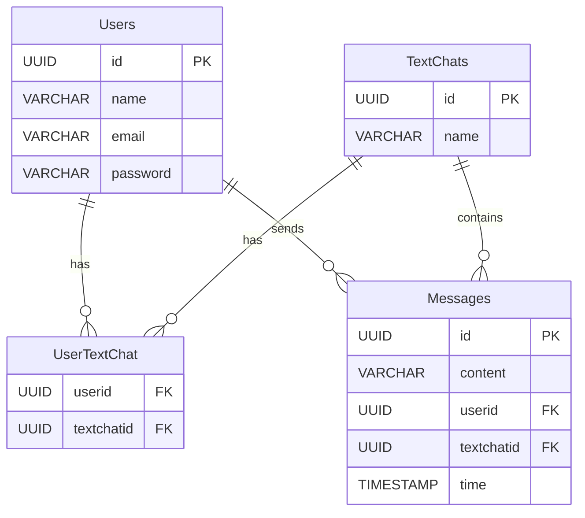

# DROCSID

## Client

### Preparation
```bash
$ npm install
$ npm run dev
```

### Page
[drocsid](https://localhost:5173)

## Server

### Preparation

```bash
$ node main.js
```

#### also create .env file in ./server/config path with values
- Database
  - DB_HOST - database host like "localhost"
  - DB_USER - database user like "root"
  - DB_PASSWORD - password for user
  - DB_DATABASE - name of the database, preferably "drocsid"
- Encryption
  - SALT - char(16) used for salt enctyption for sha512

### Database structure


### Api requests
> localhost:3000
- ``/api/users/register/:name/:email/:password``
  - register new user with name, email, password encrypted using sha 512 with salt from .env 
